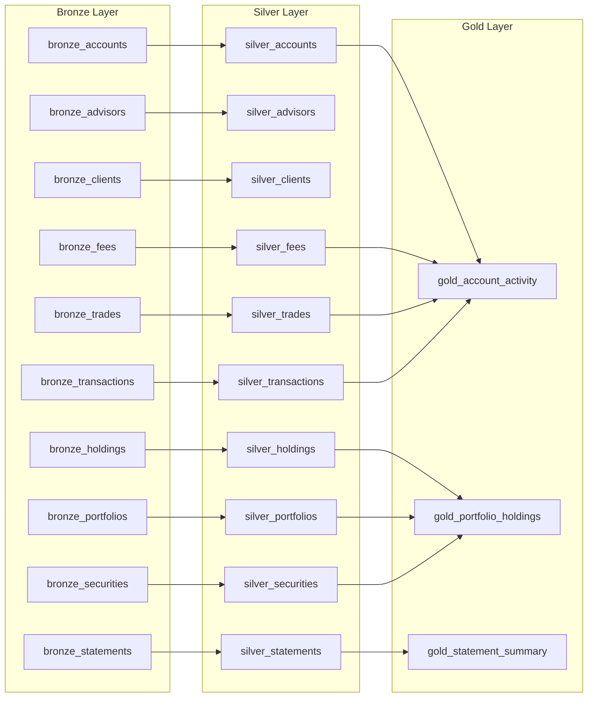

# Platform Data Lineage

Generated from SQL and YAML transformation definitions.

- Tables: 23
- Dependencies: 18
- Cycles: 0

```mermaid
flowchart LR
    subgraph BRONZE["Bronze Layer"]
        T0["bronze_accounts"]
        T1["bronze_advisors"]
        T2["bronze_clients"]
        T3["bronze_fees"]
        T4["bronze_holdings"]
        T5["bronze_portfolios"]
        T6["bronze_securities"]
        T7["bronze_statements"]
        T8["bronze_trades"]
        T9["bronze_transactions"]
    end
    subgraph SILVER["Silver Layer"]
        T13["silver_accounts"]
        T14["silver_advisors"]
        T15["silver_clients"]
        T16["silver_fees"]
        T17["silver_holdings"]
        T18["silver_portfolios"]
        T19["silver_securities"]
        T20["silver_statements"]
        T21["silver_trades"]
        T22["silver_transactions"]
    end
    subgraph GOLD["Gold Layer"]
        T10["gold_account_activity"]
        T11["gold_portfolio_holdings"]
        T12["gold_statement_summary"]
    end
    T0 --> T13
    T1 --> T14
    T2 --> T15
    T3 --> T16
    T4 --> T17
    T5 --> T18
    T6 --> T19
    T7 --> T20
    T8 --> T21
    T9 --> T22
    T13 --> T10
    T16 --> T10
    T17 --> T11
    T18 --> T11
    T19 --> T11
    T20 --> T12
    T21 --> T10
    T22 --> T10
```
